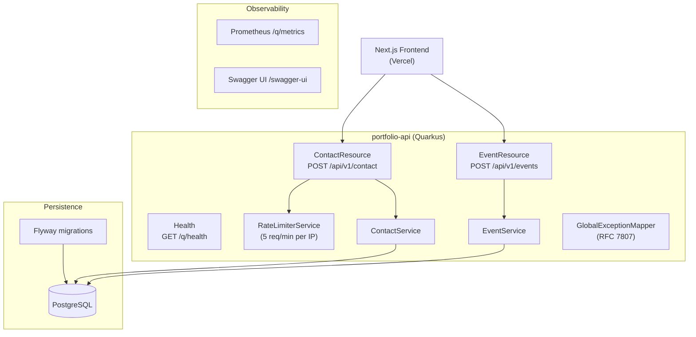

# portfolio-api

Backend microservice for [puanputri.dev](https://puanputri.dev) — built with **Quarkus 3.8 · Java 21 · PostgreSQL**.

This service is intentional: it powers the contact form and visitor analytics for a backend engineering portfolio, demonstrating the exact stack it's built to advertise.

**Frontend:** [github.com/puanputri/puan-putri-portofolio](https://github.com/puanputri/puan-putri-portofolio)

---

## Architecture



### Layered architecture

```
ContactResource  →  ContactService  →  Contact (Panache entity)
                      ↓
                  Mailer (email notification)
                  RateLimiterService (per-IP sliding window)
```

---

## API Reference

| Method | Path | Description | Auth |
|---|---|---|---|
| `POST` | `/api/v1/contact` | Submit contact form | — |
| `POST` | `/api/v1/events` | Log page view / project click | — |
| `GET` | `/q/health` | Liveness + readiness | — |
| `GET` | `/q/health/live` | Liveness only | — |
| `GET` | `/q/health/ready` | Readiness only | — |
| `GET` | `/q/metrics` | Prometheus metrics | — |
| `GET` | `/swagger-ui` | Interactive API docs | — |

### POST /api/v1/contact

**Request**
```json
{
  "name": "Recruiter Name",
  "email": "recruiter@company.com",
  "message": "We'd love to talk about a backend role..."
}
```

**Responses**

| Status | Body | When |
|---|---|---|
| `201 Created` | `ContactResponse` | Submitted successfully |
| `422 Unprocessable Entity` | `ProblemDetail` | Validation failure |
| `429 Too Many Requests` | `ProblemDetail` | >5 req/min from same IP |

### POST /api/v1/events

**Request**
```json
{
  "eventType": "PAGE_VIEW",
  "page": "/",
  "referrer": "https://linkedin.com",
  "userAgent": "Mozilla/5.0..."
}
```

`eventType` must be `PAGE_VIEW` or `PROJECT_CLICK`.

**Response:** `204 No Content`

### Error format (RFC 7807)

All errors return `Content-Type: application/problem+json`:

```json
{
  "type": "about:blank",
  "title": "Unprocessable Entity",
  "status": 422,
  "detail": "name: must not be blank",
  "instance": "/api/v1/contact"
}
```

---

## Tech Stack

| Concern | Choice |
|---|---|
| Framework | Quarkus 3.8.4 |
| Language | Java 21 |
| REST | RESTEasy Reactive + Jackson |
| ORM | Hibernate ORM with Panache |
| Database | PostgreSQL 15 |
| Migrations | Flyway |
| Validation | Jakarta Bean Validation |
| Mapping | MapStruct 1.5.5 |
| Email | Quarkus Mailer (SMTP) |
| Metrics | Micrometer + Prometheus |
| API Docs | SmallRye OpenAPI + Swagger UI |
| Health | SmallRye Health |
| Tests | JUnit 5 + REST Assured + H2 |
| Build | Maven 3.9 |
| Runtime | GraalVM native (~50 MB image) |

---

## Getting Started

### Prerequisites

- Java 21 ([Temurin](https://adoptium.net/))
- Maven 3.9+
- PostgreSQL 15+ (or Docker)
- SMTP credentials (Gmail App Password or Resend)

### 1. Clone and configure

```bash
git clone https://github.com/puanputri/portfolio-api.git
cd portfolio-api
cp .env.example .env
# Fill in .env with your DB and SMTP credentials
```

### 2. Start PostgreSQL (Docker)

```bash
docker run -d \
  --name portfolio-pg \
  -e POSTGRES_DB=portfolio \
  -e POSTGRES_USER=portfolio_user \
  -e POSTGRES_PASSWORD=changeme \
  -p 5432:5432 \
  postgres:15-alpine
```

### 3. Run in dev mode

```bash
./mvnw quarkus:dev
```

Flyway runs migrations automatically. Swagger UI available at [http://localhost:8080/swagger-ui](http://localhost:8080/swagger-ui).

### 4. Run tests

```bash
./mvnw verify
```

Tests use H2 in-memory — no external DB needed.

---

## Environment Variables

| Variable | Default | Description |
|---|---|---|
| `DB_URL` | `jdbc:postgresql://localhost:5432/portfolio` | JDBC connection URL |
| `DB_USERNAME` | `portfolio_user` | Database user |
| `DB_PASSWORD` | `changeme` | Database password |
| `MAILER_HOST` | `smtp.gmail.com` | SMTP host |
| `MAILER_PORT` | `587` | SMTP port |
| `MAILER_USERNAME` | — | SMTP username |
| `MAILER_PASSWORD` | — | SMTP password / app password |
| `MAILER_FROM` | `no-reply@puanputri.dev` | From address |
| `CONTACT_NOTIFICATION_EMAIL` | `puanputrisaqinahf@gmail.com` | Where to send contact alerts |
| `LOG_LEVEL` | `INFO` | Log level |

---

## Docker

### JVM image

```bash
./mvnw package
docker build -f src/main/docker/Dockerfile.jvm -t portfolio-api:jvm .
docker run -p 8080:8080 --env-file .env portfolio-api:jvm
```

### Native image (~50 MB)

Requires GraalVM or Mandrel:

```bash
./mvnw package -Pnative
docker build -f src/main/docker/Dockerfile.native-micro -t portfolio-api:native .
docker run -p 8080:8080 --env-file .env portfolio-api:native
```

---

## Kubernetes

```bash
# Fill in k8s/secret.yaml with real base64-encoded credentials first
kubectl apply -f k8s/configmap.yaml
kubectl apply -f k8s/secret.yaml
kubectl apply -f k8s/deployment.yaml
kubectl apply -f k8s/service.yaml
kubectl apply -f k8s/hpa.yaml
```

Manifests include: Deployment (2 replicas), Service (ClusterIP), ConfigMap, Secret, HPA (min 2 / max 5 / CPU 70%).

---

## CI/CD

GitHub Actions on every push:

1. **Test** — `mvn verify` with H2, no external services needed
2. **Build & push** (main branch only) — JVM Docker image → `ghcr.io/puanputri/portfolio-api:latest`

---

## Design Decisions

**Why Quarkus over Spring Boot?**
Faster startup (~0.3s vs ~3s), lower memory footprint in containers, and native compilation via GraalVM. Critical for elastic scaling and cold-start cost in K8s.

**Why blocking Panache over Reactive Panache?**
Reactive Panache requires Reactive PostgreSQL client (Vert.x), which adds complexity without meaningful throughput benefit at portfolio-scale traffic. Blocking Panache with `@Blocking` on resource methods is simpler, more testable, and still runs on the reactive Vert.x event loop for I/O.

**Why MapStruct over manual mapping?**
Compile-time code generation — no reflection, no runtime overhead, and mapping errors surface at build time rather than at runtime.

**Why RFC 7807 for errors?**
Standard format means the frontend and any future API consumers can parse errors predictably without coupling to a custom error shape.

**Why per-IP rate limiting in-process?**
Portfolio traffic is low; no Redis dependency needed. The sliding window ConcurrentHashMap implementation handles the load without infrastructure overhead. For production scale, move to a Redis-backed token bucket.
